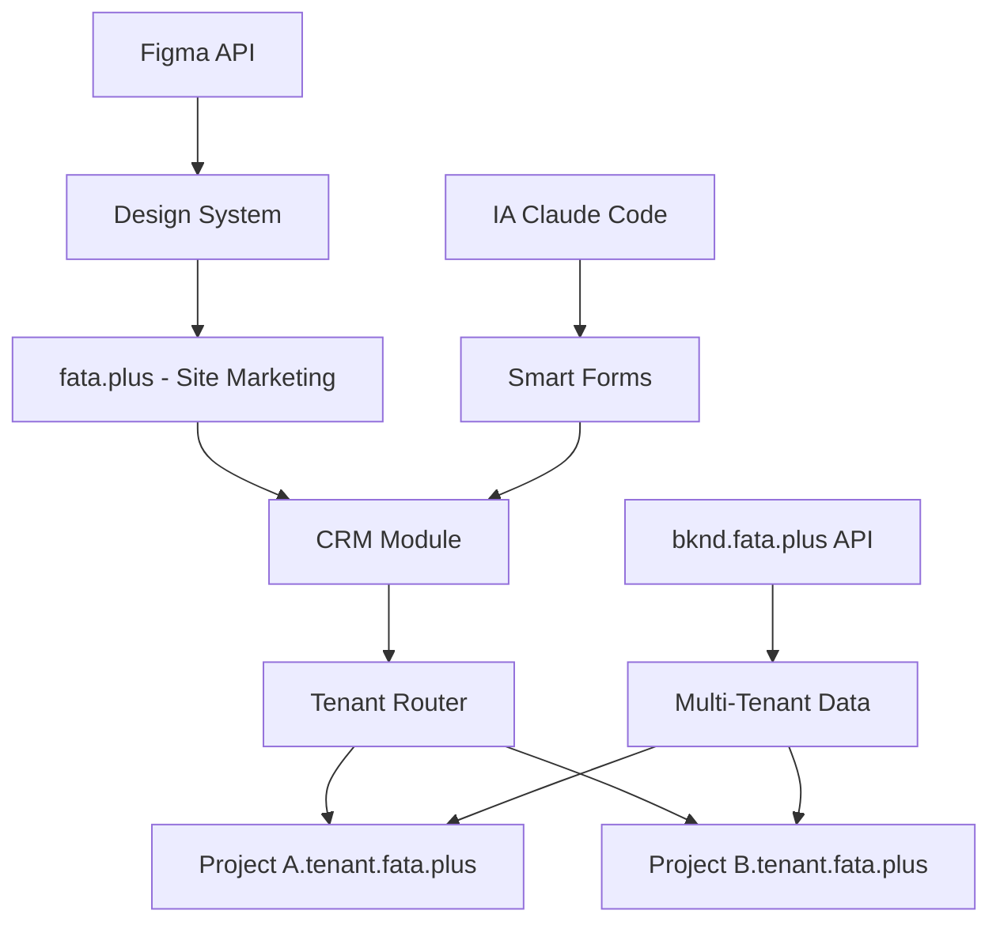

# Architecture Fataplus Interopérabilité

## 🌐 Configuration Domaines Cloudflare

### fata.plus (Frontend)
```bash
# Configuration DNS Cloudflare
fata.pro -> CNAME proxy.cloudflare.com
*.fata.plus -> CNAME proxy.cloudflare.com

# Pages Routing
fata.plus/              # Site marketing agence
fata.plus/crm          # CRM multi-tenant
fata.plus/bootcamp     # Formation UX/UI
[tenant].fata.plus     # Accès client par projet
```

### bknd.fata.plus (Backend)
```bash
# Backend existant
bknd.fata.plus/api/*   # API REST
bknd.fata.plus/ws/*    # Websockets
```

## 🏗️ Architecture Multi-Tenant



## 📊 Modules CRM

### 1. Formulaire Intake IA
```javascript
// src/components/crm/IntakeForm.astro
- Capture besoins client
- Analyse IA des requirements
- Génération automatique propositions
- Intégration bknd.fata.plus/api/leads
```

### 2. Dashboard Multi-Projets
```javascript
// src/pages/[tenant]/dashboard.astro
- Métriques par projet
- Suivi AgriTech applications
- Analytics bootcamp UX/UI
- ROI client IA-powered
```

### 3. Gestion Collaborative
```javascript
// src/components/crm/Collaboration.astro
- Partage agences partenaires
- Permissions par tenant
- Workflow design review
- Version control Figma
```

## 🔌 Intégrations Techniques

### Backend bknd.fata.plus
```javascript
// src/lib/bknd-client.js
const API_BASE = 'https://bknd.fata.plus/api'

// Endpoints principaux
GET    /projects          // Liste projets tenant
POST   /projects          // Créer projet
GET    /clients           // Gestion clients
POST   /intake            // Formulaire intake
```

### Frontend Astro Routes
```javascript
// src/pages/[tenant]/[...slug].astro
// Routing multi-tenant dynamique

// src/pages/api/[...slug].astro
// Proxy vers bknd.fata.plus
```

## 🚀 Déploiement Cloudflare

```yaml
# wrangler.toml
name = "fataplus-crm"
compatibility_date = "2025-11-12"
compatibility_flags = ["nodejs_compat"]

[[routes]]
pattern = "fata.pro/*"
zone_name = "fata.pro"

[[routes]]
pattern = "*.fata.pro/*"
zone_name = "fata.pro"
```

## 📈 Performance & Sécurité

- **CDN Cloudflare** global
- **Edge functions** pour le routing
- **Zero Trust** pour l'accès multi-tenant
- **Analytics** intégrés
- **SSL/WAF** automatique