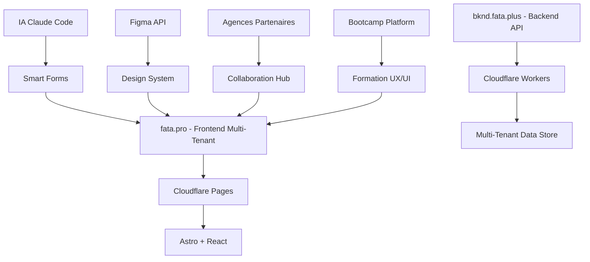

# 🚀 Fataplus Interopérabilité - CRM Multi-Tenant IA-Powered

<div align="center">


**Système CRM interopérable pour l'agence digitale Fataplus avec architecture multi-tenant et IA intégrée**

[🌐 Site Web](https://fata.plus) • [📚 Documentation](./documentation/) • [🔧 API Docs](./docs/api/) • [🎯 Démo](https://demo.fata.plus)

</div>

---

## 📋 **Table des Matières**

- [🎯 Vision](#-vision)
- [🏗️ Architecture](#️-architecture)
- [✨ Fonctionnalités](#-fonctionnalités)
- [🚀 Démarrage Rapide](#-démarrage-rapide)
- [📁 Structure du Projet](#-structure-du-projet)
- [🔧 Configuration](#-configuration)
- [🌐 Déploiement](#-déploiement)
- [🤝 Contribuer](#-contribuer)
- [📄 License](#-license)

---

## 🎯 **Vision**

**Fataplus Interopérabilité** est une plateforme CRM complète conçue pour les agences digitales modernes. Notre système combine :

- **🤖 IA-Powered** : Assistant intelligent pour la gestion client
- **🏢 Multi-Tenant** : Architecture SaaS scalable par projet
- **🎨 Design-First** : Intégration parfaite avec Figma et outils de design
- **🌾 AgriTech Focus** : Solutions spécialisées pour le secteur agricole
- **🎓 Formation** : Bootcamp UX/UI et Product Design intégré

> **Financement** : PIC Pole Intégré de Croissance Madagascar
> **Incubation** : Zafy Tody Antananarivo

---

## 🏗️ **Architecture Technique**



### **Stack Technique**

| Composant | Technologie | Déploiement |
|-----------|-------------|--------------|
| **Frontend** | Astro + React + Tailwind CSS | Cloudflare Pages |
| **Backend** | Node.js + Hono + D1 Database | Cloudflare Workers |
| **IA** | Claude Code API + Custom Models | Cloudflare Workers AI |
| **Design** | Figma API + Design System | Cloudflare R2 Storage |
| **Auth** : | OAuth2 + Zero Trust | Cloudflare Access |

---

## ✨ **Fonctionnalités**

### 🎯 **CRM Multi-Tenant**
- **Dashboard IA-Powered** : Analytics et insights intelligents
- **Formulaire Intake** : Capture automatisée avec analyse IA
- **Gestion Projets** : Organisation par tenant et client
- **Collaboration** : Partage avec agences partenaires

### 🎨 **Design System**
- **Intégration Figma** : Synchronisation designs en temps réel
- **Components UI** : Bibliothèque partagée et réutilisable
- **Brand Management** : Gestion identité visuelle par tenant

### 🎓 **Bootcamp UX/UI**
- **Formation Complète** : Product Design + No-Code + IA
- **Projets Pratiques** : Cas réels AgriTech
- **Certification** : Validation des compétences

### 🌾 **AgriTech Platform**
- **Solutions Spécialisées** : Applications pour le secteur agricole
- **Analytics** : Métriques et suivi ROI
- **Marketplace** : Connexion agriculteurs et solutions

---

## 🚀 **Démarrage Rapide**

### **Prérequis**

```bash
# Node.js 18+ requis
node --version  # >= 18.20.8

# Compte Cloudflare
# Compte GitHub avec accès Fataplus
```

### **Installation**

```bash
# 1. Cloner le repository
git clone https://github.com/Fataplus/Fataplus.git
cd Fataplus

# 2. Installer les dépendances
npm install

# 3. Configurer l'environnement
cp .env.example .env.local
# Éditer .env.local avec vos clés

# 4. Démarrer le développement
npm run dev
```

### **Configuration Rapide**

```bash
# Variables d'environnement requises
CLOUDFLARE_API_KEY=votre_clé_api
CLOUDFLARE_ACCOUNT_ID=votre_account_id
DATABASE_ID=votre_database_d1
FIGMA_ACCESS_TOKEN=votre_token_figma
CLAUDE_API_KEY=votre_claude_api_key
```

---

## 📁 **Structure du Projet**

```
fataplus-interoperabilite/
├── 📄 README.md                   # Documentation principale
├── 📄 ARCHITECTURE.md             # Architecture technique détaillée
├── 📄 SECURITY_AUDIT.md           # Audit de sécurité
├── 📄 DEPLOYMENT.md               # Instructions déploiement
│
├── 🔧 backend-integration/        # API Backend
│   └── fataplus-bknd-backend/     # Backend principal bknd.fata.plus
│
├── 🎨 frontend/                   # Projets Frontend
│   ├── astro-crm/                 # CRM principal (Astro + React)
│   ├── fataplus-website/          # Site marketing agence
│   ├── fataplus-portal/           # Portail client
│   ├── fataplus-intake-form/      # Formulaire intelligent
│   └── fataplus-static-website/   # Site statique
│
├── 📚 documentation/              # Spécifications techniques
│   ├── specs/                     # Specs complètes FP-09
│   ├── 01-PROJECTS/              # Projets documentés
│   └── templates/                 # Templates réutilisables
│
├── 🤝 collaboration/              # Projets partenaires
│   └── apollon-lab/               # Collaboration ApollonLab
│
├── 🎓 bootcamp/                   # Formation UX/UI
│   └── agri-ai-design-lab/        # Programme bootcamp complet
│
├── 🌾 agritech/                   # Projets AgriTech
│   └── fp-09-platform/            # Plateforme AgriTech FP-09
│
└── 🎨 figma-designs/              # Designs Figma (à compléter)
```

---

## 🔧 **Configuration**

### **1. Cloudflare Setup**

```bash
# Installer Wrangler
npm install -g wrangler

# Authentifier Cloudflare
wrangler auth login

# Créer base de données D1
wrangler d1 create fataplus-crm-db

# Déployer les schemas
wrangler d1 execute fataplus-crm-db --file=./schemas/init.sql
```

### **2. Figma Integration**

```bash
# Créer Figma App
# https://www.figma.com/developers/apps

# Configurer les permissions:
# - Read files
# - Read comments
# - Webhooks
```

### **3. Environment Variables**

```bash
# .env.local
CLOUDFLARE_API_KEY=your_api_key
CLOUDFLARE_ACCOUNT_ID=your_account_id
DATABASE_ID=your_d1_database_id
FIGMA_ACCESS_TOKEN=your_figma_token
CLAUDE_API_KEY=your_claude_api_key
OAUTH_CLIENT_ID=your_oauth_client
OAUTH_CLIENT_SECRET=your_oauth_secret
```

---

## 🌐 **Déploiement**

### **Développement Local**

```bash
npm run dev          # Frontend développement
npm run dev:backend  # Backend développement
npm run dev:full     # Stack complète
```

### **Production Cloudflare**

```bash
# Builder le frontend
npm run build

# Déployer sur Cloudflare Pages
npm run deploy:pages

# Déployer les Workers
npm run deploy:workers

# DNS et domaines
npm run setup:dns
```

### **Domaines Configurés**

- **fata.pro** → Site marketing + CRM
- **bknd.fata.pro** → API backend
- **[tenant].fata.pro** → Accès client multi-tenant

---

## 🤝 **Contribuer**

Nous welcome les contributions ! Voici comment participer :

### **Guidelines de Contribution**

1. **Fork** le repository
2. **Créer** une branche `feature/votre-fonctionnalité`
3. **Committer** avec des messages clairs
4. **Pusher** vers votre fork
5. **Ouvrir** une Pull Request

### **Standards de Code**

```bash
# Linter et formatter
npm run lint
npm run format

# Tests
npm run test
npm run test:e2e

# Build verification
npm run build
npm run type-check
```

### **Types de Contributions Welcome**

- 🐛 **Bug Fixes** : Corrections et améliorations
- ✨ **Nouvelles Features** : Fonctionnalités CRM, IA, design
- 📚 **Documentation** : Guides, tutoriels, API docs
- 🎨 **Design** : Components UI, design system
- 🔧 **DevOps** : Scripts déploiement, CI/CD

---

## 📊 **Métriques & Monitoring**

### **Performance**

- **Core Web Vitals** : >90 score
- **Time to First Byte** : <200ms
- **Uptime** : 99.9% SLA

### **Sécurité**

- **Zero Trust** : Cloudflare Access
- **WAF** : Protection automatique
- **Audit** : Scans de sécurité mensuels

### **Analytics**

- **User Analytics** : Comportement utilisateurs
- **Performance** : Métriques techniques
- **Business** : ROI et conversions

---

## 🤖 **Intégrations IA**

### **Claude Code Integration**

```javascript
// Exemple d'utilisation IA
const claudeResponse = await claude.analyze({
  context: 'intake_form',
  data: formData,
  instructions: 'Analyser les besoins client et proposer solutions'
});
```

### **Fonctionnalités IA**

- **Smart Forms** : Analyse automatique des besoins
- **Design Suggestions** : Recommandations UI/UX
- **Content Generation** : Textes et propositions
- **Analytics** : Insights prédictifs

---

## 📄 **License**

Ce projet est sous license **MIT** - voir le fichier [LICENSE](./LICENSE) pour les détails.

---

## 🙏 **Remerciements**

- **PIC Madagascar** : Financement et soutien
- **Zafy Tody** : Incubation et mentorat
- **ApollonLab** : Collaboration technique
- **Cloudflare** : Infrastructure et support
- **Figma** : Outils de design

---

## 📞 **Contact**

- **🌐 Site Web** : https://fata.plus
- **📧 Email** : contact@fata.plus
- **📍 Localisation** : Antananarivo, Madagascar
- **💬 Discord** : [Serveur Communauté](https://discord.gg/fataplus)

---

<div align="center">

**⭐ Si ce projet vous aide, n'hésitez pas à le starer !**

Made with ❤️ by **Fataplus Team** - Madagascar 🇲🇬

</div>