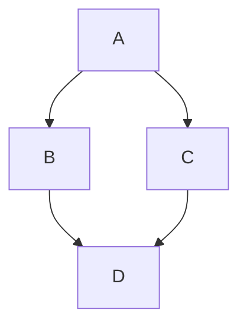
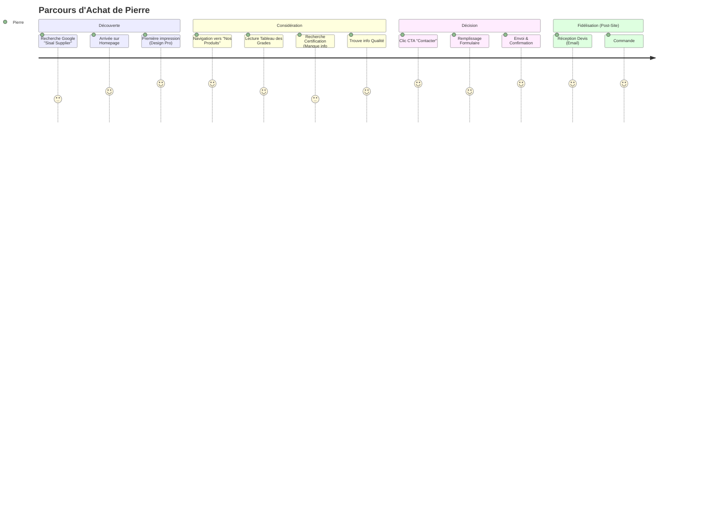
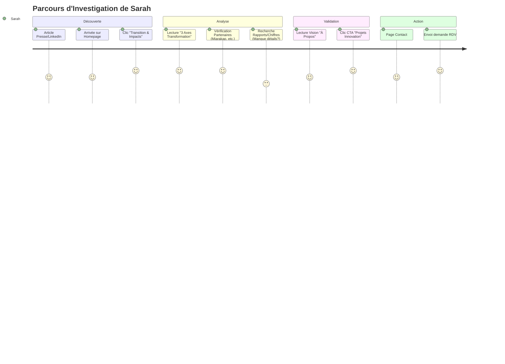
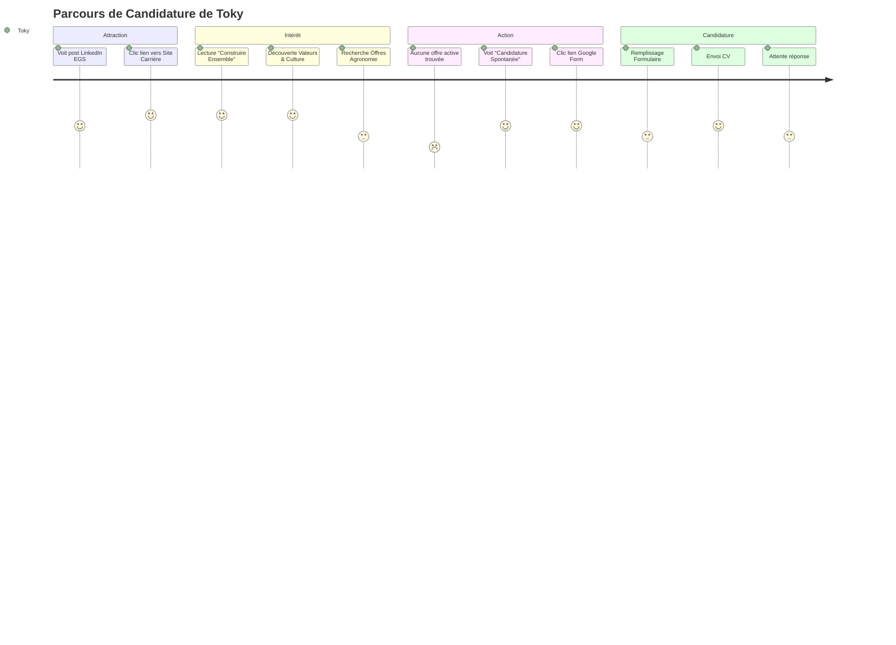

# Mermaid Test

Here is a simple Mermaid diagram:

Customer Journey Maps - EGS Gallois Sisal

Journey Map : Pierre (Acheteur B2B)

Journey Map : Sarah (Investisseuse Impact)

Journey Map : Toky (Candidat)

