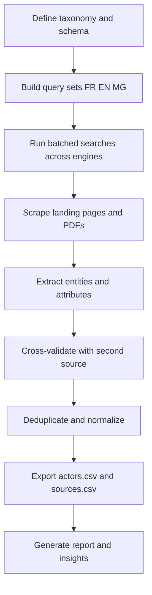

# Madagascar Agriculture Stakeholders Directory - Project Plan

## Scope and deliverables
- Exhaustive list of agriculture stakeholders in Madagascar across the value chain.
- Deliver as:
  - Clean, deduplicated CSV of actors with rich fields.
  - Human-readable Markdown report with clickable source links.
  - Queries log and scraping snippets for reproducibility.

## Proposed repository structure
- data/actors.csv
- data/sources.csv
- logs/queries.csv
- reports/Stakeholders-Madagascar.md
- scripts/search_scrape.py
- scripts/pdf_extract.py
- scripts/deduplicate_normalize.py
- README.md

Notes
- actors.csv holds the master consolidated dataset.
- sources.csv maps each data point to its source URL and publication date.
- queries.csv logs exact search queries and timestamps.
- scripts directory contains reproducible code for search, scrape, parse, dedup.

## Category taxonomy (initial)
- Government institutions, agencies, research centers
- Public policy programmes and projects
- International organisations, development banks, donors
- Farmers associations, cooperatives, unions
- Private agribusinesses
  - Inputs, Seeds, Fertilizers, Agrochemicals, Equipment
  - Production: crops, livestock, fisheries, forestry
- Processing and value addition
- Storage and logistics
- Finance and microfinance
- Insurance
- Marketplaces and exporters
- Advisory and extension services
- AgriTech, FoodTech, ClimateTech, bio-innovation startups
- NGOs and non-profits (rural dev, food security, climate, biodiversity)
- Academic bodies, universities, vocational schools, incubators
- Investors, accelerators, venture funds, angel networks
- Professional federations, chambers, think-tanks
- Certification bodies and laboratories (quality, organic, fair-trade)
- Major events, trade fairs, hackathons, competitions
- Water user associations and irrigation agencies
- Standards and metrology offices

## Value chain segments (initial)
- Inputs
- Production
- Aggregation
- Processing
- Storage
- Logistics and distribution
- Finance
- Insurance
- Market access and exports
- Advisory, training, extension
- Research and innovation
- Policy and regulation
- Certification and testing
- Events and networks

## CSV schema: data/actors.csv
- actor_id: stable unique ID (slug)
- official_name
- legal_status
- year_founded
- category
- segments
- activities
- products_services
- technologies
- commodities
- geographic_scope
- regions_covered
- address
- country
- website
- email
- phone
- social_links
- leadership
- ownership
- partnerships
- programmes
- recognitions
- latest_metrics
- source_summary
- source_count
- last_verified_at
- notes

Field notes
- segments: pipe-separated list from the controlled vocabulary.
- activities: short description of domains.
- commodities: pipe-separated, e.g., vanilla|clove|lychee|rice.
- social_links: pipe-separated URLs.
- leadership: key people and roles, short text.
- latest_metrics: normalized, e.g., funding USD, beneficiaries, hectares.
- source_summary: brief list of main sources used.
- last_verified_at: ISO date.

## Sources table: data/sources.csv
- actor_id
- field
- value_excerpt
- source_url
- source_publisher
- source_type
- source_language
- source_publication_date
- access_date

## Queries log: logs/queries.csv
- timestamp
- engine
- locale
- query
- category
- new_actors_found
- unique_actors_total
- stop_rule_triggered

## Search methodology and query templates
Base operators
- site:
- inurl:
- intitle:
- filetype:pdf
- quotes and OR

Languages
- French
- English
- Malagasy

Core templates (French)
- site:.gov.mg agriculture Madagascar
- site:minae.gov.mg OR site:gouv.mg agriculture programme
- filetype:pdf Madagascar agriculture rapport annuel
- coopérative agricole Madagascar
- organisme certificateur Madagascar agriculture
- assurance agricole Madagascar
- banque agricole Madagascar
- agritech Madagascar
- irrigation Madagascar projet

Core templates (English)
- Madagascar agriculture stakeholder list
- Madagascar agricultural cooperative
- Madagascar agribusiness company
- Madagascar seed company
- Madagascar fertilizer distributor
- Madagascar agri insurance
- Madagascar microfinance agriculture
- Madagascar agricultural export company
- Madagascar food processing company

Core templates (Malagasy, indicative)
- fambolena Madagasikara fikambanana
- tantsaha fikambanana
- orinasa sakafo Madagasikara
- fiompiana fikambanana
- fampahafantarana tetikasa fambolena

Domain-targeted queries
- site:fao.org Madagascar agriculture project
- site:ifad.org Madagascar project
- site:worldbank.org Madagascar agriculture project
- site:usaid.gov Madagascar agriculture
- site:afd.fr Madagascar agriculture
- site:giz.de Madagascar agriculture
- site:europa.eu Madagascar agriculture fund
- site:comesa.int Madagascar agriculture
- site:sadc.int Madagascar agriculture
- site:onn.mg nutrition agriculture Madagascar
- site:bngrc.gov.mg agriculture
- site:lexpressmada.com OR site:midimadagasikara.mg agriculture

Social and company discovery
- site:linkedin.com/company Madagascar agriculture
- site:twitter.com Madagascar agriculture Madagascar
- CEO Madagascar agriculture

Stopping criteria
- Stop when rate of new unique actors in last 10 queries < 2 percent, or after 10 successive queries yield no novel actor.

## Validation protocol
- Cross-check each actor with at least two independent sources.
- Prefer official websites, government registries, donor project pages.
- For metrics, capture value, unit, period, and currency.
- Record source URL and publication dates for each critical field into sources.csv.

## Deduplication rules
- Normalize names (casefold, remove punctuation, standardize accents).
- Fuzzy-match by name with Levenshtein >= 0.9 and same website or phone.
- Merge records sharing identical website domain or official registration details.
- Manual review queue for ambiguous merges.

## Report outline: reports/Stakeholders-Madagascar.md
- Executive summary (≤ 500 words)
- Methodology
- Ecosystem map by category
- Top actors by segment
- Notable programmes and partnerships
- Trends and gaps
- Appendix: exact queries and code snippets

## Reproducibility snippets
Python requests example

```python
import csv, time, requests
from bs4 import BeautifulSoup

engines = [
  ("bing", "https://www.bing.com/search?q={}"),
  ("duckduckgo", "https://duckduckgo.com/html/?q={}")
]

queries = [
  "site:.gov.mg agriculture Madagascar",
  "filetype:pdf Madagascar agriculture rapport annuel"
]

results = []
for engine, url_tmpl in engines:
  for q in queries:
    url = url_tmpl.format(requests.utils.quote(q))
    r = requests.get(url, timeout=20, headers={"User-Agent":"Mozilla/5.0"})
    soup = BeautifulSoup(r.text, "html.parser")
    results.append((engine, q, len(soup.text)))
    time.sleep(2)

with open("logs/queries.csv","w",newline="") as f:
  w = csv.writer(f)
  w.writerow(["timestamp","engine","locale","query","category","new_actors_found","unique_actors_total","stop_rule_triggered"])
  ts = time.strftime("%Y-%m-%dT%H:%M:%SZ", time.gmtime())
  for engine, q, n in results:
    w.writerow([ts, engine, "fr", q, "", "", "", ""])
```

Hyperbrowser MCP usage sketch
- Use scrape_webpage for specific URLs and output markdown and links.
- Use crawl_webpages with followLinks true and maxPages tuned per domain.
- Store extracted links and parse company pages for contacts and leaders.

## Mermaid workflow



## Open questions for approval
- Accept delivering both actors.csv and sources.csv to fully track source per field.
- Budget for paid sources such as Crunchbase Pro or LinkedIn Sales Navigator.
- Language prioritization order across FR EN MG.
- Minimum recency threshold for metrics and reports, e.g., since 2019.
- Specific commodities or regions to emphasize, if any.