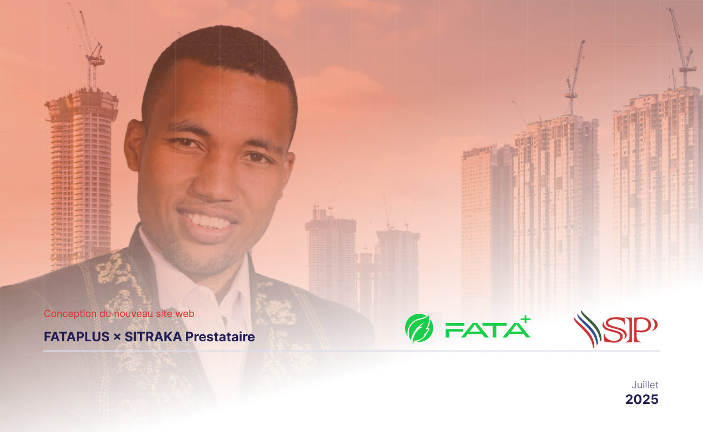

Ceci est un slide slidev

---
theme: apple-basic
background: /sitraka-cover.jpg
---

  FATAPLUS × SITRAKA

  <h1 class="text-6xl font-bold">Pitch Deck</h1>
  
Conception du nouveau site web

  
Juillet 2025 • Antananarivo

<!--
Presenter note
Bonjour Sitraka, Hermisa et Sumario de FATAPLUS. 
Nous allons vous montrer en 8 diapos comment nous allons créer votre site ultra-rapide avec Figma + Vault.
-->

---

# Pourquoi refaire votre site ?

- **Objectif 1** : doubler les demandes de création d’entreprise en 6 mois  
- **Objectif 2** : devenir la référence juridique en ligne à Madagascar  
- **Objectif 3** : réduire le temps de traitement d’un dossier de 48 h à 24 h grâce à l’automatisation web

---

# Qui fait quoi ?

| Rôle | Membre FATAPLUS | Vos interlocuteurs |
|---|---|---|
| **Chef de projet** | Hermisa | WhatsApp unique, planning, livraison |
| **UX / UI Designer** | Sumario | Wireframes, design system, prototype Figma |
| **Support Dev** | Fenohery | Intégration, tests, déploiement |

---

# Process en 4 phases

1. **Brief & Discovery** (J-1 → J0)  
   Atelier 2 h avec Sitraka, audit logo & contenu

2. **Wireframes** (J1 → J3)  
   Figma low-fi validé en 24 h

3. **UI Design** (J4 → J8)  
   Thème Vault, palette bleu #0056B3, responsive 3 breakpoints

4. **Livraison & Déploiement** (J9 → J10)  
   Guide de style + prototype cliquable + check-list dev

---

# Aperçu visuel

Palette & typographie déjà définies dans Vault UI-Core

---

# Fonctionnalités clés

- **Formulaire de devis instantané** (Notion embed)  
- **Chat WhatsApp flottant**  
- **Calendly intégré** pour prise de rendez-vous  
- **SEO local** (schema.org + Google Maps Ambohipo)

---

# Calendrier & engagements

| Semaine | Livrable |
|---|---|
| 1 | Brief validé + Wireframes |
| 2 | UI complet + prototype |
| 3 | Tests + ajustements |
| 4 | Handoff dev + formation 30 min |

---

# Coût & garanties

- **Forfait design** : 1 200 000 Ar MGA HT  
- **Révisions** : 2 tours inclus  
- **Garantie** : 30 jours de support post-lancement

---

# Prochaine étape

1. **Signer le devis** (envoyé par Hermisa)  
2. **Réserver l’atelier Brief** (1 h, visio Zoom)  
3. **Démarrage immédiat** après accord

 

  <button class="bg-blue-600 text-white px-8 py-3 rounded-full font-bold">
    Je valide →
  </button>

<!--
Merci Sitraka ! 
Whatsapp : +261 34 20 472 13   
Fenohery : fenohery@fata.plus
-->
