# 📧 Guide Setup Email Marketing - Bootcamp Fataplus

## 🎯 Objectif

Configurer l'automatisation email pour convertir les leads en inscrits qualifiés avec des séquences personnalisées et adaptées au contexte malgache.

---

## 🛠️ Outils Recommandés

### **Primary Choice : Mailchimp**
- **Coût** : Free jusqu'à 500 contacts, puis ~10€/mois
- **Avantages** : Automatisation avancée, templates professionnels, analytics
- **Intégration** : Facebook Pixel, Google Analytics, Shopify

### **Alternative : Brevo (anciennement Sendinblue)**
- **Coût** : Free jusqu'à 300 emails/jour
- **Avantages** : SMS marketing inclus, interface française
- **Support** : Bon support client francophone

### **Premium Option : ConvertKit**
- **Coût** : ~29€/mois pour 1000 contacts
- **Avantages** : Très orienté créateurs, automatisation puissante
- **Inconvénient** : Plus cher, en anglais principalement

---

## 📋 Étape 1 : Configuration Compte Mailchimp

### **1. Création du Compte**
```bash
1. Aller sur mailchimp.com
2. Choisir plan Free
3. Créer compte avec :
   - Email : fenohery.fanomezanirina@gmail.com
   - Nom : Fataplus
   - Entreprise : FATAPLUS SARL
```

### **2. Configuration Audience**
```bash
1. Créer audience "Bootcamp Leads"
2. Champs personnalisés requis :
   - first_name (Texte)
   - last_name (Texte)
   - phone (Téléphone)
   - age (Nombre)
   - education (Liste déroulante)
   - experience (Liste déroulante)
   - objectives (Texte long)
   - preferred_mode (Liste déroulante)
   - availability (Liste déroulante)
   - discovery (Liste déroulante)
   - interest_level (Liste déroulante)
   - source (Texte)
   - registration_date (Date)
```

### **3. Configuration Formulaires**
```bash
1. Formulaire inscription principal :
   - Titre : "Inscription Bootcamp Product Design"
   - Champs : Tous les champs requis
   - Page de confirmation : Redirection vers landing page
   - Email de bienvenue : Email 1 (Programme complet)

2. Formulaire contact secondaire :
   - Pour les questions avant inscription
   - Moins de champs, plus simple
```

---

## 📧 Étape 2 : Configuration Séquences Automation

### **Workflow 1 : Nurturing Sequence**

```mermaid
graph TD
    A[Nouvelle inscription] --> B{Lead Score}
    B -->|Élevé| C[Email 1 : Programme]
    B -->|Moyen| D[Email 1 simplifié]
    B -->|Bas| E[Email 1 teaser]

    C --> F[Ouvert Email 1?]
    F -->|Oui| G[Email 2 : Contexte]
    F -->|Non| H[Rappel Email 1]

    G --> I[Cliqué CTA?]
    I -->|Oui| J[Email 3 : Preuve sociale]
    I -->|Non| K[Email 2 : Contexte]

    J --> L[Email 4 : Éducation]
    L --> M[Email 5 : Urgence]

    M --> N{Inscrit?}
    N -->|Oui| O[Séquence onboarding]
    N -->|Non| P[Email dernier rappel]
```


### **Configuration Technique Mailchimp**
```javascript
// Campaign Settings
const campaignConfig = {
    from_name: "Fenohery Fanomezanirina",
    from_email: "fenohery@fataplus.mg",
    reply_to: "fenohery.fanomezanirina@gmail.com",

    // Tracking settings
    track_opens: true,
    track_clicks: true,
    google_analytics: true,

    // Timing
    timezone: "Indian/Antananarivo",

    // Personalization
    merge_tags: {
        "*|FNAME|*": "first_name",
        "*|LNAME|*": "last_name",
        "*|EMAIL|*": "email"
    }
};
```

### **Automation Triggers**
```javascript
// Trigger 1 : New Registration
trigger1 = {
    type: "form_submission",
    form_id: "bootcamp_registration",
    action: "start_nurturing_sequence",
    delay: "immediate"
};

// Trigger 2 : High Engagement
trigger2 = {
    type: "engagement",
    conditions: {
        emails_opened: 3,
        links_clicked: 2
    },
    action: "send_priority_content",
    delay: "1_day"
};

// Trigger 3 : Abandonment
trigger3 = {
    type: "inactivity",
    conditions: {
        days_since_last_email: 7,
        not_clicked: true
    },
    action: "send_re_engagement",
    delay: "immediate"
};
```

---

## 📝 Étape 3 : Templates et Contenus

### **Création des Templates**
```bash
1. Template principal "Fataplus Brand" :
   - Header avec logo Fataplus
   - Footer avec coordonnées
   - Palette de couleurs cohérente
   - Responsive design mobile

2. Template programme :
   - Sections structurées
   - Images des projets
   - CTA buttons bien visibles
   - Social proof intégrée

3. Template urgence :
   - Design plus percutant
   - Compteurs de temps
   - Scarcity elements
   - Multiple CTAs
```

### **Configuration des Variables**
```handlebars
<!-- Exemple de template Mailchimp -->
*|IF:FNAME|* Bonjour *|FNAME|*, *|ELSE:|* Bonjour, *|END:IF|*

Merci pour votre inscription à notre Bootcamp Product Design !

*|IF:INTEREST_LEVEL=high|*
Vous avez montré un grand intérêt...
*|ELSE:|*
Découvrez notre programme...
*|END:IF|*

[Programme détaillé](*|UPDATE_PROFILE|*link=*|URL|*?program=full*|END:UPDATE_PROFILE|*)
```

---

## 📊 Étape 4 : Analytics et Tracking

### **Configuration Mailchimp Analytics**
```javascript
// Email Analytics Setup
const analyticsConfig = {
    // Open tracking
    open_tracking: {
        enabled: true,
        pixel_tracking: true
    },

    // Click tracking
    click_tracking: {
        enabled: true,
        url_tracking: true
    },

    // Google Analytics
    google_analytics: {
        enabled: true,
        tracking_id: "GA_MEASUREMENT_ID",
        campaign_name: "bootcamp_automation"
    },

    // Ecommerce tracking
    ecommerce_tracking: {
        enabled: true,
        currency: "EUR"
    }
};
```

### **Custom Event Tracking**
```javascript
// Tracking personnalisé pour le bootcamp
mailchimp.track("bootcamp_engagement", {
    event_category: "email_engagement",
    event_label: "program_download",
    value: 1,
    user_properties: {
        lead_source: "facebook_ad",
        cohort_interest: "january_2026"
    }
});
```

### **Report Configuration**
```bash
Rapports hebdomadaires à configurer :
1. Performance globale campagne
2. Taux d'ouverture par email
3. Taux de clics par CTA
4. Taux de conversion
5. Désabonnements
6. Engagement par segment

Alertes automatiques :
- Taux d'ouverture < 20%
- Taux de clics < 5%
- Taux de désabonnement > 3%
- Conversion rate < 2%
```

---

## 🔗 Étape 5 : Intégrations

### **Intégration Facebook Pixel**
```javascript
// Facebook Pixel dans Mailchimp
mailchimp.addIntegration("facebook_pixel", {
    pixel_id: "YOUR_PIXEL_ID",
    track_events: [
        "PageView",
        "ViewContent",
        "AddToCart",
        "Purchase"
    ],
    custom_events: [
        "bootcamp_registration",
        "program_download",
        "webinar_registration"
    ]
});
```

### **Intégration Landing Page**
```html
<!-- Dans la landing page -->
<script id="mcjs">!function(c,h,i,m,p){m=c.createElement(h),p=c.getElementsByTagName(h)[0],m.async=1,m.src=i,p.parentNode.insertBefore(m,p)}(document,"script","https://chimpstatic.com/mcjs-connected/js/users/YOUR_USER_ID/YOUR_LIST_ID.js");</script>

<!-- Form integration -->
<form id="mc-embedded-subscribe-form" action="https://fataplus.us21.list-manage.com/subscribe/post?u=YOUR_USER_ID&amp;id=YOUR_LIST_ID" method="post">
    <!-- Champs du formulaire -->
</form>
```

### **Intégration Google Analytics 4**
```javascript
// GA4 event tracking depuis Mailchimp
gtag('event', 'email_open', {
    event_category: 'email_marketing',
    event_label: 'bootcamp_nurturing',
    campaign_id: 'bootcamp_automation_2025',
    custom_parameter_1: '{{lead.source}}'
});

gtag('event', 'email_click', {
    event_category: 'email_marketing',
    event_label: '{{clicked_link}}',
    link_url: '{{clicked_url}}'
});
```

---

## 📱 Étape 6 : Mobile Optimization

### **Responsive Design Guidelines**
```css
/* Mobile-first email styles */
@media screen and (max-width: 600px) {
    .email-container {
        width: 100% !important;
        max-width: 600px !important;
    }

    .header-image {
        width: 100% !important;
        height: auto !important;
    }

    .cta-button {
        width: 100% !important;
        padding: 15px 0 !important;
        font-size: 16px !important;
    }

    .social-links {
        text-align: center !important;
    }
}
```

### **Mobile Testing Checklist**
```bash
✅ Test sur iPhone (iOS)
✅ Test sur Android
✅ Test sur Gmail app
✅ Test sur Outlook mobile
✅ Test sur différents écrans
✅ Test des liens et CTA
✅ Test des images
✅ Test du responsive design
```

---

## ⚡ Étape 7 : Performance Optimization

### **Deliverability Optimization**
```javascript
// Email deliverability settings
const deliverabilityConfig = {
    // Sending reputation
    sender_score: {
        target: "> 90",
        monitoring: "daily"
    },

    // IP warming
    ip_warming: {
        schedule: "gradual_increase",
        daily_limit: {
            week1: 50,
            week2: 100,
            week3: 200,
            week4: 500
        }
    },

    // Content optimization
    content_optimization: {
        spam_score_check: true,
        subject_line_testing: true,
        preview_text_optimization: true
    }
};
```

### **A/B Testing Setup**
```javascript
// A/B test configuration
const abTestConfig = {
    test_type: "subject_line",
    audience_size: "50%",
    test_duration: "24_hours",
    winner_criteria: "open_rate",

    variants: {
        variant_a: {
            subject: "🎓 Votre programme complet Bootcamp Product Design",
            preview: "Formation certifiée Figma EDU"
        },
        variant_b: {
            subject: "Transformez votre carrière en 12 semaines",
            preview: "Devenez Product Designer certifié"
        }
    }
};
```

---

## 🚨 Étape 8 : Compliance et Légal

### **RGPD Compliance**
```javascript
// GDPR configuration
const gdprConfig = {
    consent_management: {
        explicit_consent: true,
        consent_storage: "database",
        consent_retention: "5_years"
    },

    data_processing: {
        lawful_basis: "legitimate_interest",
        data_minimization: true,
        purpose_limitation: true
    },

    user_rights: {
        access_requests: "automated",
        deletion_requests: "automated",
        portability_requests: "automated"
    }
};
```

### **Required Legal Elements**
```html
<!-- Footer légal requis -->
<div class="legal-footer">
    <p>FATAPLUS SARL</p>
    <p>Antananarivo, Madagascar</p>
    <p>Email : contact@fataplus.mg</p>
    <p>Téléphone : +261 XX XX XXX XX</p>

    <p><a href="https://fataplus.mg/privacy">Politique de confidentialité</a></p>
    <p><a href="https://fataplus.mg/terms">Conditions générales</a></p>

    <p>Vous recevez cet email car vous vous êtes inscrit à notre liste.</p>
    <p><a href="*|UNSUB|*">Se désinscrire</a> | <a href="*|UPDATE_PROFILE|*">Mettre à jour</a></p>
</div>
```

---

## 📈 Monitoring et Maintenance

### **Daily Checks**
```bash
✅ Email delivery rates
✅ Open rates
✅ Click rates
✅ Spam complaints
✅ Unsubscribes
✅ Server responses
```

### **Weekly Reviews**
```bash
✅ Campaign performance
✅ List growth
✅ Engagement trends
✅ Conversion rates
✅ Revenue attribution
✅ A/B test results
```

### **Monthly Optimization**
```bash
✅ List cleaning (inactive subscribers)
✅ Content refresh based on performance
✅ Segmentation refinement
✅ Automation rule updates
✅ Template improvements
✅ Integration testing
```

---

## 🎯 KPIs à Suivre

### **Email Marketing Metrics**
- **List Growth Rate** : +10% par mois
- **Open Rate** : 45%+ average
- **Click Rate** : 15%+ average
- **Conversion Rate** : 5%+ to registration
- **Unsubscribe Rate** : <2% maximum
- **Spam Complaints** : <0.1%

### **Business Metrics**
- **Cost Per Lead** : <5€
- **Lead to Customer Rate** : 15%+
- **Revenue Per Email** : >2€
- **Email ROI** : >4000%

### **Engagement Metrics**
- **Read Time** : 2+ minutes average
- **Forward Rate** : 3%+
- **Social Shares** : 2%+
- **Reply Rate** : 5%+

---

## 🆘 Support et Dépannage

### **Common Issues**
```bash
Problem : Low open rates
Solution :
- Check sender reputation
- Improve subject lines
- Clean list regularly
- Test sending times

Problem : High unsubscribe rates
Solution :
- Review content relevance
- Check email frequency
- Improve personalization
- Verify consent quality

Problem : Delivery issues
Solution :
- Check DNS settings (SPF, DKIM, DMARC)
- Monitor blacklists
- Improve list hygiene
- Use dedicated IP
```

### **Support Contacts**
```bash
Mailchimp Support : support@mailchimp.com
Technical Issues : +1 (855) 864-4373
Documentation : mailchimp.com/help

Local Support :
- IT Consultant Madagascar
- Email Marketing Freelancer
- Digital Marketing Agency
```

---

*Guide setup email marketing créé pour campagne Fataplus - 16 Octobre 2025*