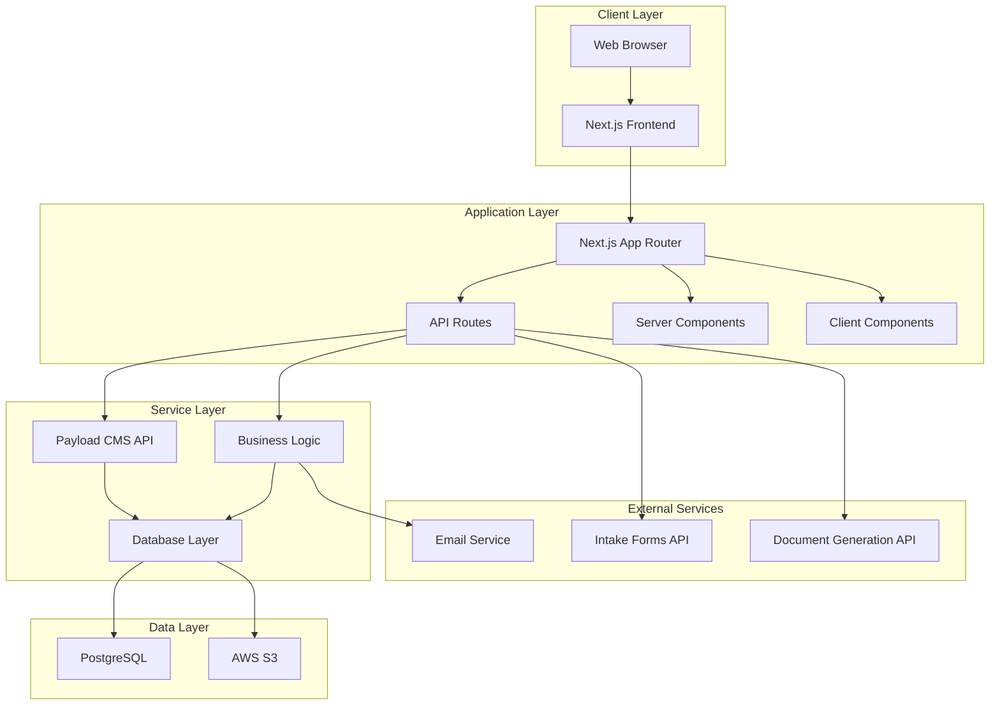
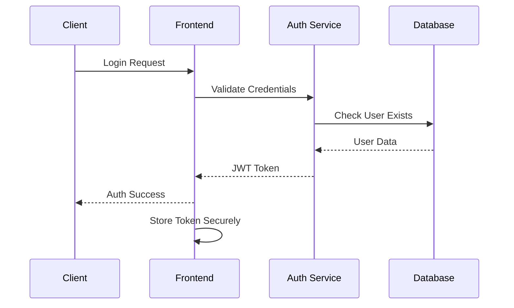

# Fataplus Portal Architecture

## System Overview

The Fataplus Client Portal is built on a modern, scalable architecture leveraging the portal-mini-store-template foundation. The system follows a microservices-friendly pattern with clear separation of concerns.

## Technology Stack

### Frontend Layer
- **Next.js 15**: App Router, Server Components, API Routes
- **React 19**: Server Components, Client Components, Suspense
- **TypeScript**: Type safety throughout the application
- **Tailwind CSS**: Utility-first styling
- **Framer Motion**: Animations and transitions

### Backend Layer
- **Payload CMS 3.0**: Headless CMS with admin panel
- **Next.js API Routes**: Server-side business logic
- **PostgreSQL**: Primary database with Prisma ORM
- **NextAuth.js**: Authentication and session management

### Infrastructure
- **Vercel**: Primary hosting platform
- **Vercel Postgres**: Managed PostgreSQL database
- **AWS S3**: File storage and CDN
- **Resend**: Email services

## Architecture Diagram



## Database Schema

### Core Collections

#### Users Collection
```sql
CREATE TABLE users (
  id SERIAL PRIMARY KEY,
  email VARCHAR(255) UNIQUE NOT NULL,
  first_name VARCHAR(100) NOT NULL,
  last_name VARCHAR(100) NOT NULL,
  company VARCHAR(255) NOT NULL,
  role VARCHAR(50) DEFAULT 'client',
  password_hash VARCHAR(255),
  created_at TIMESTAMP DEFAULT NOW(),
  updated_at TIMESTAMP DEFAULT NOW()
);
```

#### Projects Collection
```sql
CREATE TABLE projects (
  id SERIAL PRIMARY KEY,
  project_name VARCHAR(255) NOT NULL,
  status VARCHAR(50) DEFAULT 'intake',
  client_id INTEGER REFERENCES users(id),
  project_manager_id INTEGER REFERENCES users(id),
  description TEXT,
  start_date DATE,
  expected_delivery DATE,
  created_at TIMESTAMP DEFAULT NOW(),
  updated_at TIMESTAMP DEFAULT NOW()
);
```

#### Documents Collection
```sql
CREATE TABLE documents (
  id SERIAL PRIMARY KEY,
  title VARCHAR(255) NOT NULL,
  type VARCHAR(50) NOT NULL,
  project_id INTEGER REFERENCES projects(id),
  file_url VARCHAR(500),
  version VARCHAR(20) DEFAULT '1.0',
  access_level VARCHAR(20) DEFAULT 'client',
  created_at TIMESTAMP DEFAULT NOW(),
  updated_at TIMESTAMP DEFAULT NOW()
);
```

#### Messages Collection
```sql
CREATE TABLE messages (
  id SERIAL PRIMARY KEY,
  project_id INTEGER REFERENCES projects(id),
  sender_id INTEGER REFERENCES users(id),
  content TEXT NOT NULL,
  file_attachments TEXT[],
  is_internal BOOLEAN DEFAULT false,
  created_at TIMESTAMP DEFAULT NOW()
);
```

## API Architecture

### RESTful API Design

```typescript
// API Routes Structure
/api/
├── auth/
│   ├── login/
│   ├── logout/
│   └── register/
├── projects/
│   ├── [id]/
│   ├── [id]/documents/
│   └── [id]/messages/
├── documents/
│   ├── [id]/
│   └── upload/
├── users/
│   └── profile/
└── webhooks/
    ├── intake/
    └── document-generated/
```

### API Response Format

```typescript
interface APIResponse<T> {
  success: boolean;
  data?: T;
  error?: string;
  message?: string;
}

interface PaginationResponse<T> {
  success: boolean;
  data: T[];
  pagination: {
    page: number;
    limit: number;
    total: number;
    totalPages: number;
  };
}
```

## Component Architecture

### Frontend Structure

```typescript
src/
├── app/
│   ├── (auth)/
│   │   ├── login/
│   │   └── register/
│   ├── (dashboard)/
│   │   ├── projects/
│   │   ├── documents/
│   │   └── profile/
│   ├── admin/
│   └── api/
├── components/
│   ├── ui/
│   ├── forms/
│   ├── layout/
│   └── features/
├── lib/
│   ├── payload/
│   ├── auth/
│   └── utils/
└── types/
    ├── api.ts
    ├── collections.ts
    └── ui.ts
```

### Component Hierarchy

```typescript
// Layout Components
AppLayout
├── Header
│   ├── Navigation
│   ├── UserMenu
│   └── Notifications
├── Sidebar
│   ├── ProjectList
│   ├── QuickActions
│   └── HelpSection
└── Footer

// Feature Components
ProjectDashboard
├── ProjectOverview
├── RecentDocuments
├── ActivityFeed
└── QuickLinks

DocumentManager
├── DocumentList
├── DocumentViewer
├── UploadComponent
└── VersionHistory

MessageCenter
├── ConversationList
├── ChatInterface
├── FileAttachments
└── MessageHistory
```

## Security Architecture

### Authentication Flow



### Authorization Model

```typescript
interface UserPermissions {
  canViewProjects: boolean;
  canEditProjects: boolean;
  canViewDocuments: boolean;
  canUploadDocuments: boolean;
  canSendMessage: boolean;
  canManageUsers: boolean;
}

const rolePermissions: Record<UserRole, UserPermissions> = {
  client: {
    canViewProjects: true,
    canEditProjects: false,
    canViewDocuments: true,
    canUploadDocuments: false,
    canSendMessage: true,
    canManageUsers: false,
  },
  'project-manager': {
    canViewProjects: true,
    canEditProjects: true,
    canViewDocuments: true,
    canUploadDocuments: true,
    canSendMessage: true,
    canManageUsers: false,
  },
  admin: {
    canViewProjects: true,
    canEditProjects: true,
    canViewDocuments: true,
    canUploadDocuments: true,
    canSendMessage: true,
    canManageUsers: true,
  },
};
```

## Integration Architecture

### External Service Integrations

#### Intake Form Integration
```typescript
interface IntakeFormData {
  clientEmail: string;
  clientName: string;
  companyName: string;
  projectName: string;
  projectDescription: string;
  requirements: string[];
}

const intakeWebhookHandler = async (data: IntakeFormData) => {
  // 1. Create/Update Client Account
  // 2. Initialize Project
  // 3. Trigger Document Generation
  // 4. Send Welcome Email
};
```

#### Document Generation Integration
```typescript
interface DocumentGenerationRequest {
  projectId: string;
  documentType: 'PRD' | 'TDR';
  templateId: string;
  variables: Record<string, any>;
}

const documentGenerationHandler = async (request: DocumentGenerationRequest) => {
  // 1. Call Document Generation API
  // 2. Store Generated Document
  // 3. Update Project Status
  // 4. Notify Client
};
```

## Performance Optimization

### Caching Strategy

```typescript
// Next.js Caching
export const revalidate = 3600; // 1 hour

// Payload CMS Caching
const payloadConfig = {
  // Enable caching for static content
  cache: {
    maxAge: 3600,
  },
};

// Database Query Optimization
const optimizedQueries = {
  // Use indexes for frequent queries
  // Implement pagination for large datasets
  // Cache frequently accessed data
};
```

### Asset Optimization

```typescript
// Next.js Image Optimization
import Image from 'next/image';

// Lazy Loading for Components
const LazyDocumentViewer = dynamic(() => import('./DocumentViewer'), {
  loading: () => <div>Loading...</div>,
  ssr: false,
});

// Bundle Optimization
const config = {
  experimental: {
    optimizeCss: true,
    optimizePackageImports: ['@heroicons/react'],
  },
};
```

## Monitoring and Observability

### Error Tracking

```typescript
// Error Boundary Implementation
class ErrorBoundary extends React.Component {
  componentDidCatch(error, errorInfo) {
    // Log to monitoring service
    console.error('Application Error:', error, errorInfo);
  }
}

// API Error Handling
const apiErrorHandler = (error: Error) => {
  // Log error details
  // Send to monitoring service
  // Return user-friendly message
};
```

### Performance Monitoring

```typescript
// Web Vitals Tracking
import { getCLS, getFID, getFCP, getLCP, getTTFB } from 'web-vitals';

const reportWebVitals = (metric) => {
  // Send to analytics service
};

// Custom Performance Metrics
const trackPageLoad = (page: string, loadTime: number) => {
  // Track page-specific performance
};
```

## Deployment Architecture

### Environment Configuration

```typescript
// Environment-specific configs
const environments = {
  development: {
    apiUrl: 'http://localhost:3000/api',
    databaseUrl: process.env.DEV_DATABASE_URL,
    enableDebugMode: true,
  },
  staging: {
    apiUrl: 'https://staging.fataplus.com/api',
    databaseUrl: process.env.STAGING_DATABASE_URL,
    enableDebugMode: false,
  },
  production: {
    apiUrl: 'https://portal.fataplus.com/api',
    databaseUrl: process.env.PROD_DATABASE_URL,
    enableDebugMode: false,
  },
};
```

### CI/CD Pipeline

```yaml
# GitHub Actions Workflow
name: Deploy Fataplus Portal
on:
  push:
    branches: [main]
  pull_request:
    branches: [main]

jobs:
  test:
    runs-on: ubuntu-latest
    steps:
      - uses: actions/checkout@v3
      - uses: actions/setup-node@v3
      - run: npm ci
      - run: npm run test
      - run: npm run build

  deploy:
    needs: test
    runs-on: ubuntu-latest
    if: github.ref == 'refs/heads/main'
    steps:
      - uses: actions/checkout@v3
      - name: Deploy to Vercel
        uses: amondnet/vercel-action@v20
        with:
          vercel-token: ${{ secrets.VERCEL_TOKEN }}
          vercel-org-id: ${{ secrets.ORG_ID }}
          vercel-project-id: ${{ secrets.PROJECT_ID }}
```

This architecture provides a solid foundation for a scalable, secure, and maintainable client portal that can grow with Fataplus's needs.

---